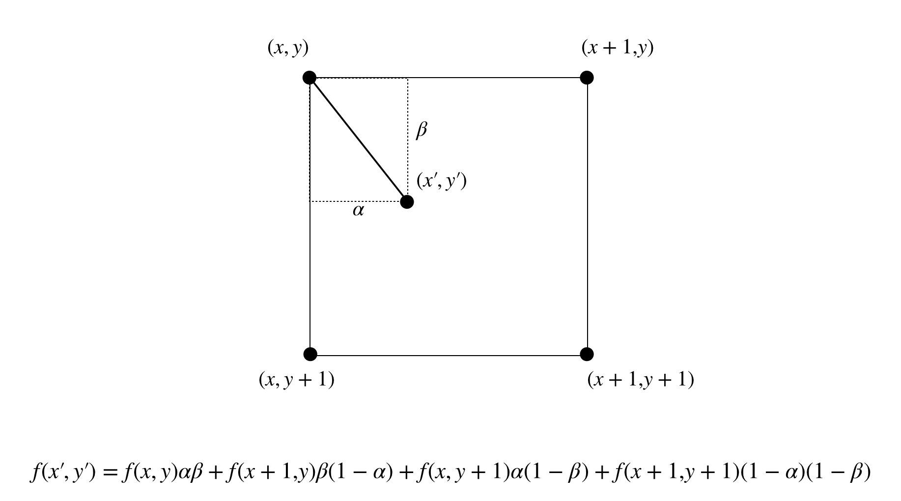

# resize

 [](https://golangci.com)

This package lets you to resize image using LERP algorism.

## LERP algorism

In mathematics, linear interpolation is a method of curve fitting using linear polynomials to construct new data points within the range of a discrete set of known data points.

https://en.wikipedia.org/wiki/Linear_interpolation



## Quick start

```go
package main

import (
	"image"
	"image/png"
	"os"

	"github.com/po3rin/resize"
)

func main() {
	img, _, _ := image.Decode(os.Stdin)
	dst := resize.Resize(img, 2, 2)
	png.Encode(os.Stdout, dst)
}
```
